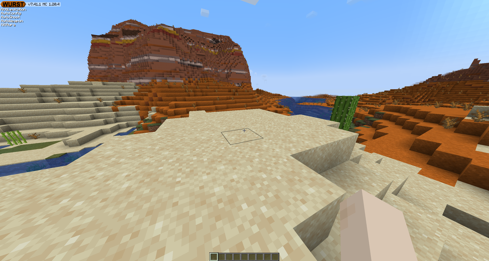

# Wurst Component
A simple example component for LiquidBounce recreating the HUD of the Wurst client. This repository also acts as a base project for creating custom components.

## Installation
1. Download the latest release from the [releases tab](releases).
2. Extract the zip file, open the file called `index.html` and copy its content to the clipboard.
3. Run LiquidBounce, join a world and execute `.client component add iframe .`.
4. Open the ClickGUI, locate the HUD module and expand its settings.
5. Find the setting called `Frame` under `Custom` and expand it.
6. Paste the code you copied into the `Src` setting.
7. Adjust the alignment to your liking.